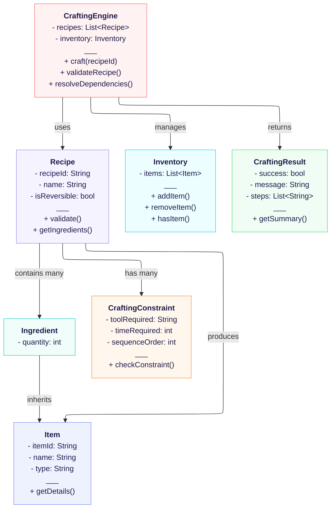
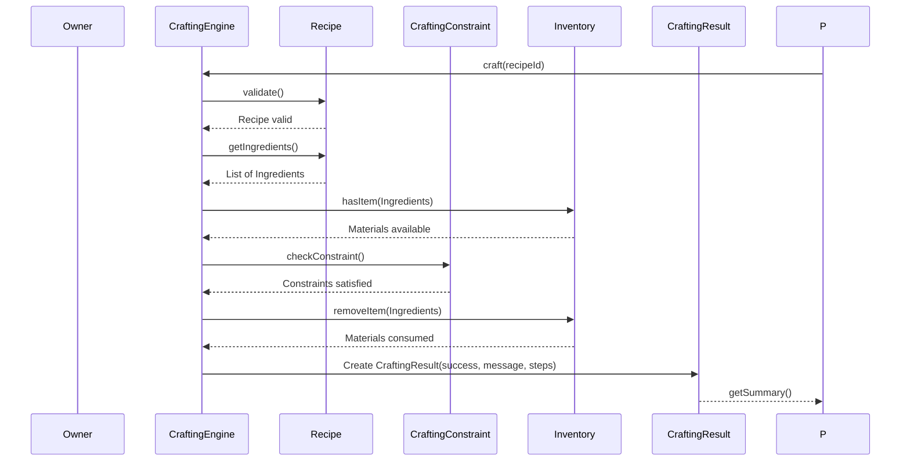

#Recipe-and-Crafting-Rule-Engine

```mermaid
---
config:
  layout: elk
---
flowchart TD
    Item["<b>Item</b><br/>- itemId: String<br/>- name: String<br/>- type: String<br/>___<br/>+ getDetails()"]:::itemClass
    
    Ingredient["<b>Ingredient</b><br/>- quantity: int"]:::ingredientClass
    
    Recipe["<b>Recipe</b><br/>- recipeId: String<br/>- name: String<br/>- isReversible: bool<br/>___<br/>+ validate()<br/>+ getIngredients()"]:::recipeClass
    
    CraftingConstraint["<b>CraftingConstraint</b><br/>- toolRequired: String<br/>- timeRequired: int<br/>- sequenceOrder: int<br/>___<br/>+ checkConstraint()"]:::constraintClass
    
    Inventory["<b>Inventory</b><br/>- items: List&lt;Item&gt;<br/>___<br/>+ addItem()<br/>+ removeItem()<br/>+ hasItem()"]:::inventoryClass
    
    CraftingEngine["<b>CraftingEngine</b><br/>- recipes: List&lt;Recipe&gt;<br/>- inventory: Inventory<br/>___<br/>+ craft(recipeId)<br/>+ validateRecipe()<br/>+ resolveDependencies()"]:::engineClass
    
    CraftingResult["<b>CraftingResult</b><br/>- success: bool<br/>- message: String<br/>- steps: List&lt;String&gt;<br/>___<br/>+ getSummary()"]:::resultClass
    
    Ingredient -->|inherits| Item
    Recipe -->|contains many| Ingredient
    Recipe -->|produces| Item
    Recipe -->|has many| CraftingConstraint
    CraftingEngine -->|uses| Recipe
    CraftingEngine -->|manages| Inventory
    CraftingEngine -->|returns| CraftingResult
    
    classDef itemClass stroke:#818cf8,fill:#eef2ff,color:#1e1b4b
    classDef ingredientClass stroke:#2dd4bf,fill:#f0fdfa,color:#1e1b4b
    classDef recipeClass stroke:#a78bfa,fill:#f5f3ff,color:#1e1b4b
    classDef constraintClass stroke:#fb923c,fill:#fff7ed,color:#1e1b4b
    classDef inventoryClass stroke:#22d3ee,fill:#ecfeff,color:#1e1b4b
    classDef engineClass stroke:#f87171,fill:#fef2f2,color:#1e1b4b
    classDef resultClass stroke:#4ade80,fill:#f0fdf4,color:#1e1b4b
    classDef inheritArrow stroke:#6b7280,fill:none
    classDef relationArrow stroke:#9ca3af,fill:none
```

```mermaid
sequenceDiagram
    participant O as Owner
    participant CE as CraftingEngine
    participant R as Recipe
    participant C as CraftingConstraint
    participant I as Inventory
    participant CR as CraftingResult

    P->>CE: craft(recipeId)
    CE->>R: validate()
    R-->>CE: Recipe valid

    CE->>R: getIngredients()
    R-->>CE: List of Ingredients

    CE->>I: hasItem(Ingredients)
    I-->>CE: Materials available

    CE->>C: checkConstraint()
    C-->>CE: Constraints satisfied

    CE->>I: removeItem(Ingredients)
    I-->>CE: Materials consumed

    CE->>CR: Create CraftingResult(success, message, steps)
    CR-->>P: getSummary()


```
